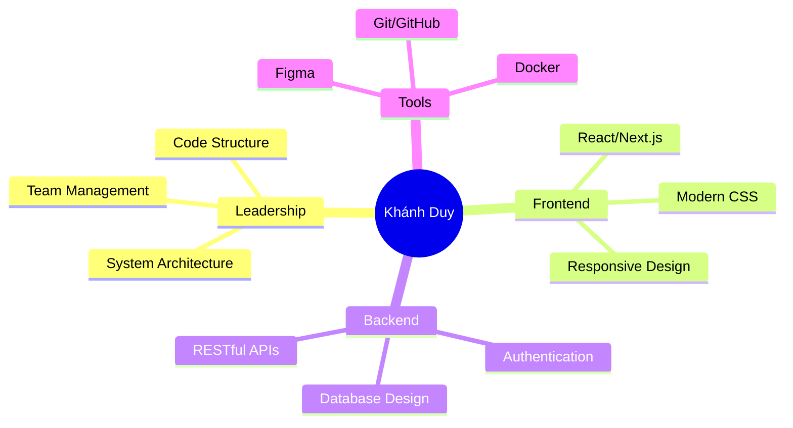

# 👋 Hi there, I'm Khánh Duy (Duy Nguyen)

<div align="center">
  


</div>

## 🚀 About Me

```javascript
const duyNguyen = {
    location: "Ho Chi Minh City, Vietnam",
    education: "FPT Polytechnic College | Web Programming",
    currentFocus: "Frontend Development & Modern Web Technologies",
    lookingFor: "Frontend Developer Intern Position",
    funFact: "I often lead team projects and love architecting systems 🏗️"
};
```

🎓 **GPA:** 3.79/4.0 | 📧 **Email:** nguyenkhanhduy23803@gmail.com | 📱 **Phone:** +84 815 934 934

---

## 💼 What I'm Looking For

**Frontend Developer Intern** position to:
- Gain hands-on experience in real-world product development
- Collaborate with experienced developers and learn industry best practices
- Apply modern frontend frameworks in production environments
- Contribute to meaningful projects while continuously improving my skills

---

## 🛠️ Tech Stack

### Frontend Development


### Backend & Database


### Tools & DevOps


---

## 📊 GitHub Stats

<div align="center">


</div>

---

## 🏆 Featured Projects

### 🎯 [ChoCongNghe Platform](https://github.com/ChoCongNgheTeam) - *Graduation Project (In Progress)*
**Role:** Team Leader & Backend Developer | **Team Size:** 6 members

```typescript
const project = {
    frontend: ["Next.js", "Tailwind CSS"],
    backend: ["Node.js", "Express", "Prisma ORM"],
    database: "PostgreSQL",
    infrastructure: ["Docker", "RESTful API"]
};
```

**Key Achievements:**
- 🏗️ Designed overall system architecture for both frontend and backend
- 👥 Led task planning, assignment, and established code conventions
- 🔧 Built RESTful APIs using Express.js with Prisma ORM
- 🐳 Dockerized backend services for consistent development environment
- 🤝 Collaborated with frontend team to define API contracts

**Repositories:**
- [Server Repository](https://github.com/ChoCongNgheTeam/cho-cong-nghe-web-server)
- [Client Repository](https://github.com/ChoCongNgheTeam/cho-cong-nghe-web-client)

---

### 💻 [NhaMayMan-Hanh](https://github.com/NhaMayMan-Hanh) - Modern E-commerce Platform
**Role:** Team Leader & System Architect

**Tech Stack:** Next.js • Tailwind CSS • Node.js • Express • MongoDB • Zod

**Highlights:**
- 🎨 Implemented modular backend architecture (Services, Controllers, Middlewares)
- 🔐 Integrated JWT authentication with role-based authorization (User/Admin)
- ✅ Applied strict data validation using Zod
- 🚀 Built comprehensive RESTful API endpoints
- 📱 Integrated API with Next.js frontend using modern data fetching patterns

---

### ⚡ [Electro](https://github.com/ElectroDev6/Electro) - PHP Native MVC E-commerce
**Role:** Team Leader & System Architect

**Tech Stack:** HTML • SCSS/CSS • PHP (Native MVC) • MySQL • Composer

**Highlights:**
- 🏛️ Designed custom PHP MVC architecture from scratch
- 🛤️ Built custom routing mechanism for URL management
- 💾 Designed MySQL database schema with CLI migration tools
- 💳 Implemented complete checkout workflow with VNPay integration
- 🎨 Developed core UI/UX for Home and Product Detail pages

---

### 🛒 [GuThanhLich](https://github.com/Nkduy23/GuThanhLich) - E-commerce Web App
**Tech Stack:** React.js • Tailwind CSS • Node.js • Express • MongoDB

**Features:**
- 🔑 JWT-based authentication (Login/Register)
- 🛍️ Shopping cart management with real-time updates
- 📄 Product pagination and advanced filtering
- 🔄 RESTful API design for products, users, and orders

---

### 📁 [Personal Skill Portfolio](https://github.com/Nkduy23/Personal-Project)
**Pure JavaScript Projects Collection** - Built with Vanilla JS to master fundamentals

**Projects Include:**
- 📊 Dashboard Analytics with dynamic charts
- ✅ Advanced Todo App (CRUD operations + filters)
- 🎯 Interactive Quiz Application
- 🖼️ Image Gallery with smooth transitions
- 🌤️ Weather App with external API integration

---

## 💪 Core Strengths


```mermaid
mindmap
  root((Khánh Duy))
    Leadership
      Team Management
      System Architecture
      Code Structure
    Frontend
      React/Next.js
      Responsive Design
      Modern CSS
    Backend
      RESTful APIs
      Database Design
      Authentication
    Tools
      Git/GitHub
      Docker
      Figma
```

---

## 🎯 Soft Skills

- 🎤 **Presentation & Communication** - Experienced in leading team discussions
- 🤝 **Teamwork** - Proven track record as team leader in multiple projects
- 💡 **Problem Solving** - Strong analytical and creative thinking
- ⏱️ **Time Management** - Balanced work and study effectively

---

## 📜 Certifications

🏅 **JavaScript Algorithms and Data Structures** - 2025


## 🌟 What Sets Me Apart

> "Not just a developer, but a **Team Leader** with proven experience in architecting systems and coordinating development teams."

- ✅ Led multiple team projects from planning to deployment
- ✅ Strong in both Frontend and Backend development
- ✅ Experience in designing system architecture
- ✅ Proven ability to manage teams and coordinate development
- ✅ Passionate about learning new technologies

---

## 📫 Let's Connect!

<div align="center">

[](mailto:nguyenkhanhduy23803@gmail.com)
[](https://github.com/Nkduy23)
[](https://www.linkedin.com/in/duy-kh%C3%A1nh-66390a3a1/)

📍 **Location:** Cu Chi District, Ho Chi Minh City, Vietnam

💼 **Open to:** Frontend Developer Intern positions

</div>

---

<div align="center">

### 💭 "Code with passion, lead with purpose, learn with curiosity"


⭐️ From [Nkduy23](https://github.com/Nkduy23) | Last updated: December 2025

</div>
